# Veilance

A crypto-to-fiat payment bridge that lets users pay at any online checkout using USDC. Generate a ZK proof of your balance on Stellar → get a virtual Visa card → pay anywhere.

## How It Works

```mermaid
flowchart LR
    A["🌟 Freighter Wallet"] -->|Generate ZK Proof| B["🔐 Veilance Circuit\n(Noir/UltraHonk)"]
    B -->|Verify on-chain| C["📜 Soroban Contract\n(Stellar Testnet)"]
    C -->|Proof verified| D["⚙️ FastAPI Backend"]
    D -->|Issue card| E["💳 Lithic API"]
    E -->|PAN, CVV, Expiry| F["🖥️ React Dashboard"]
    F -->|postMessage| G["🧩 Chrome Extension"]
    G -->|Auto-fill or\nCopy Panel| H["🛒 Merchant Checkout"]
```



```
User connects Freighter wallet → Generates ZK proof of balance
→ Backend verifies proof via Soroban contract on Stellar
→ Lithic API generates virtual card → Extension auto-fills at checkout
```

**Payment Flow:**
1. User connects Freighter wallet and generates a Noir UltraHonk ZK proof
2. Backend verifies the proof via the Soroban verifier contract on Stellar testnet
3. Lithic API creates a single-use virtual Visa card (with 5% buffer for fees)
4. Chrome extension detects checkout pages and fills card details automatically
5. If auto-fill fails (cross-origin iframes), a copy-paste panel is shown

## Tech Stack

| Layer | Technology |
|-------|-----------|
| **Backend** | Python, FastAPI, SQLModel, Lithic API |
| **Frontend** | React 18, Vite, Tailwind CSS, Freighter Wallet |
| **Smart Contract** | Soroban (Rust) on Stellar — UltraHonk verifier |
| **ZK Circuit** | Noir (UltraHonk), Barretenberg |
| **Extension** | Chrome Manifest V3, DOM extraction, currency conversion |

## Project Structure

```
veilance-app/
├── backend/          # FastAPI — card creation, ZK proof verification
│   └── src/          # main.py, config.py, models.py, services/
├── dashboard/        # React — wallet connection, payment UI
│   └── src/pages/    # Landing.jsx, Dashboard.jsx
└── extension/        # Chrome extension — checkout detection, auto-fill
    ├── content.js    # Core logic
    └── manifest.json
```

## Local Setup

**Prerequisites:** Python 3.10+, Node.js 18+

### 1. Backend
```bash
cd backend
python -m venv venv && source venv/bin/activate
pip install -r requirements.txt
```

Create `backend/.env`:
```env
API_KEY=your_api_key
LITHIC_API_KEY=your_lithic_key
LITHIC_ENVIRONMENT=sandbox
VERIFIER_CONTRACT_ID=your_soroban_contract_id
STELLAR_RPC_URL=https://soroban-testnet.stellar.org
```

```bash
uvicorn src.main:app --reload --port 8000
```

### 2. Dashboard
```bash
cd dashboard
npm install
npm run dev    # → http://localhost:3001
```

### 3. Chrome Extension
1. Go to `chrome://extensions/` → enable Developer mode
2. Click **Load unpacked** → select the `extension/` folder

## Environment

- Backend: `localhost:8000` • Dashboard: `localhost:3001`
- API docs: `localhost:8000/docs` (Swagger)
- Lithic runs in **sandbox** mode (test cards, no real charges)
- Stellar **testnet** — deploy the Soroban verifier via `just testnet` from the repo root
